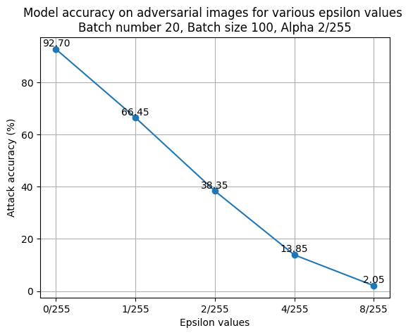

# HW1 PGD
code: https://github.com/xuanz20/CS5562-HW1.git
## Part 1
### Question 1
$(0.2, 0.8): 1 - \frac{\sqrt{17}}{5}$

$(-0.6. 0.6): 1- \frac{3\sqrt{2}}{5}$
### Question 2
$\epsilon_{\min} = 1$

maximum distance: $2(1 - \frac{\sqrt{17}}{5})$

## Part 2
### Qustion 3

### Question 4
See `finetune_resnet.ipynb` file.

The fine-tuned model file is https://drive.google.com/file/d/1Y1RMWmTRJFhAeeRPixVRzaAlifgo71vj/view?usp=drive_link